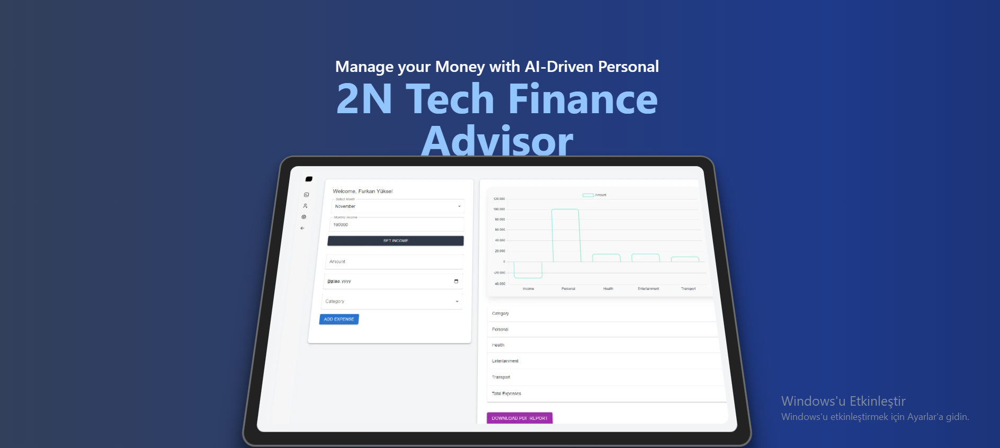
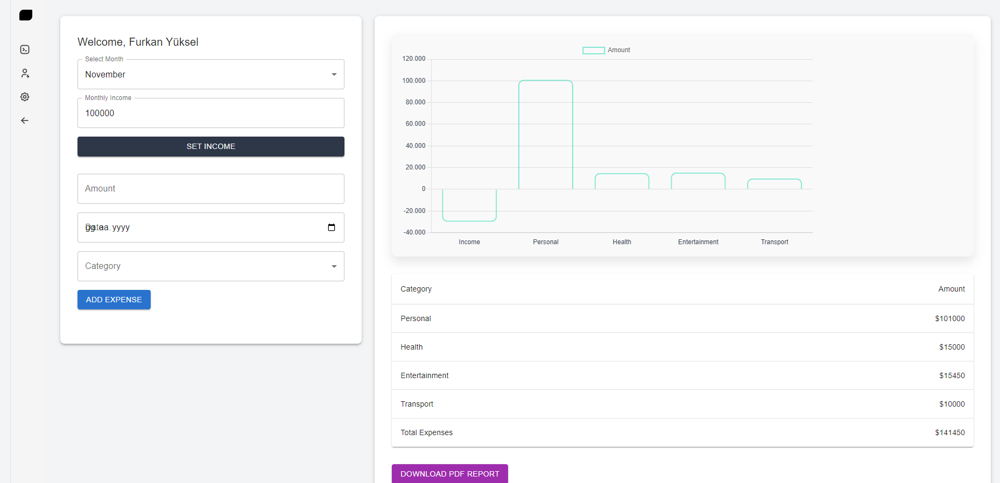
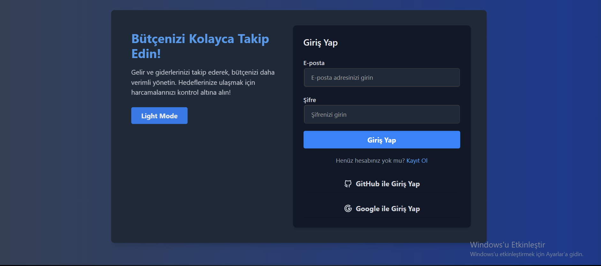
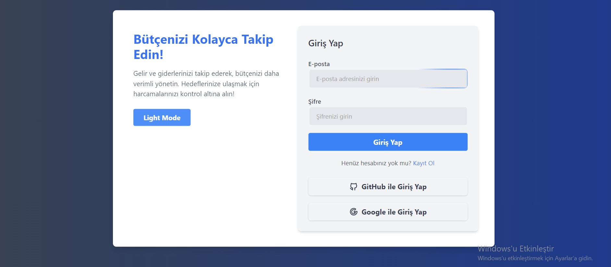
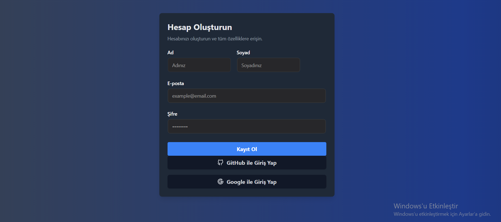
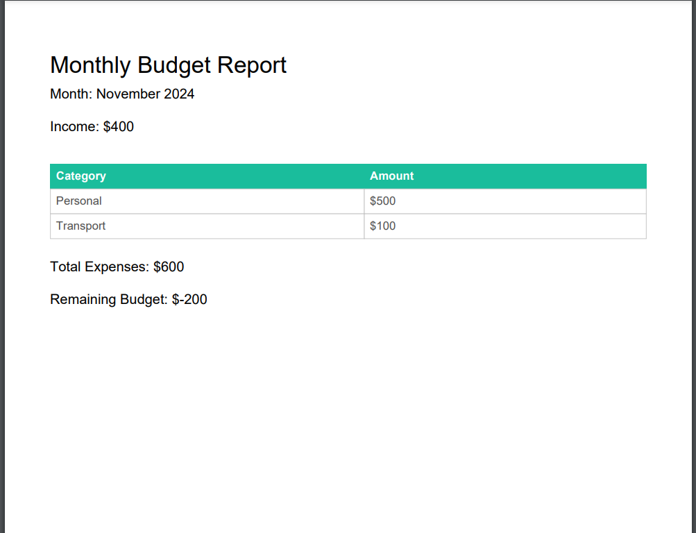

# FinTrack - Personal Finance Tracker

## 🚀 Teknolojiler

Bu projede kişisel bütçe ve harcama takibi yapılmaktadır. Kullanılan teknolojiler:

- **Next.js**: React framework for building server-rendered React apps.
- **Tailwind CSS Aceternity UI**: Utility-first CSS framework for styling.
- **Chart.js**: JavaScript charting library for rendering graphs.
- **Local Storage**: For saving user data in the browser.
- **Day.js**: Lightweight JavaScript library for working with dates.

## 🚀 Proje Açıklaması

FinTrack, kullanıcıların gelirlerini ve giderlerini takip edebilmesini sağlayan bir kişisel bütçe uygulamasıdır. Kullanıcılar, harcamalarını kategorilere ayırabilir, bütçe limitlerini belirleyebilir ve gelir-gider raporlarını görselleştirebilir.

### Özellikler:
- **Gelir ve Gider Ekleme**: Kullanıcılar gelir ve giderlerini ekleyebilir.
- **Bütçe Limiti**: Kullanıcılar kategorilere özel bütçe limitleri belirleyebilir.
- **Dinamik Grafikler**: Harcamalar ve gelirler hakkında görsel raporlar oluşturulabilir.
- **Kullanıcı Girişi**: Kullanıcılar e-posta ve şifre ile giriş yapabilirler.

## 📸 Uygulama Görselleri

Projeye ait ekran görüntüleri:

|  |  |  |  |
| ------------------ | ------------------ | ------------------ | ------------------ |
|  |  |

## 🚀 Proje Kurulumu ve Çalıştırma

1. **Proje Kurulumu :**


2. **Projelerin Yüklenmesi:**
  
     ```
   - Gerekli bağımlılıkları yükleyin:
     ```bash
     npm install --legacy-peer-deps " "
  
     ```
  3. **Projelerin Çalışması:**
        ```bash
     npm run dev
  
     ```